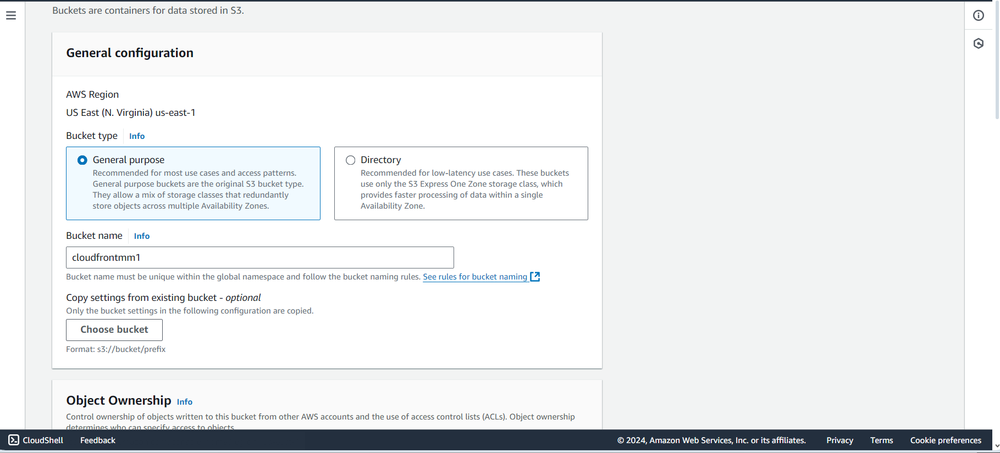
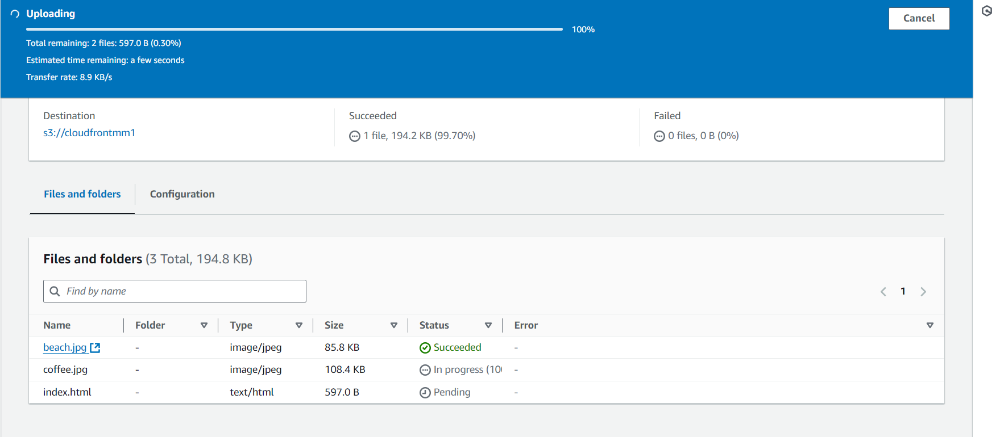
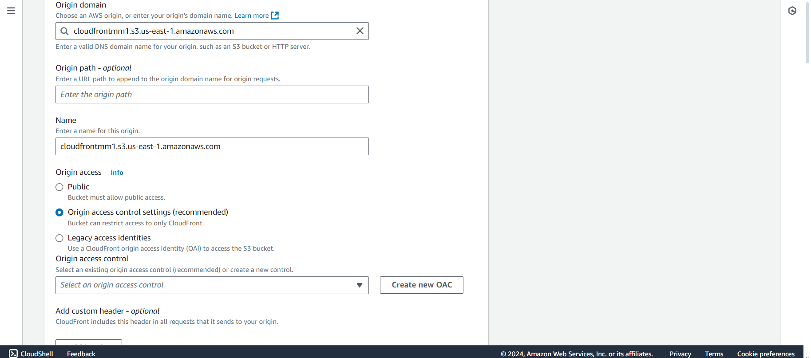
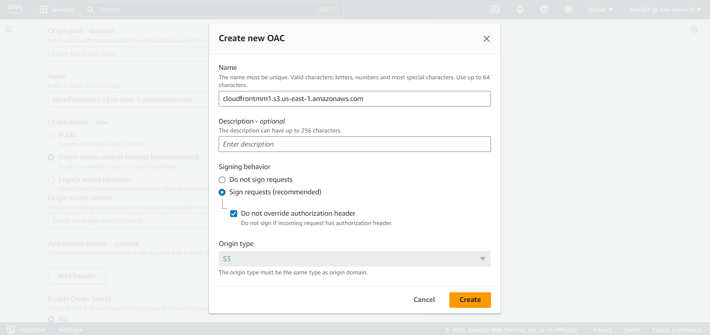
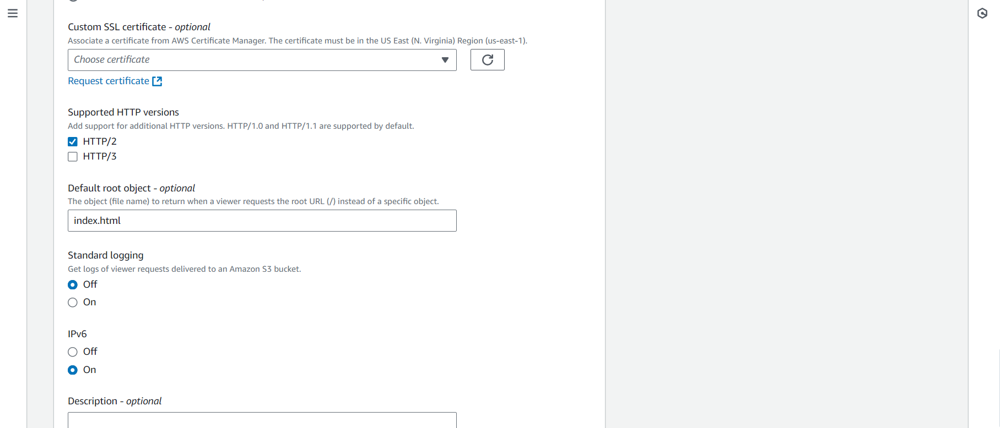
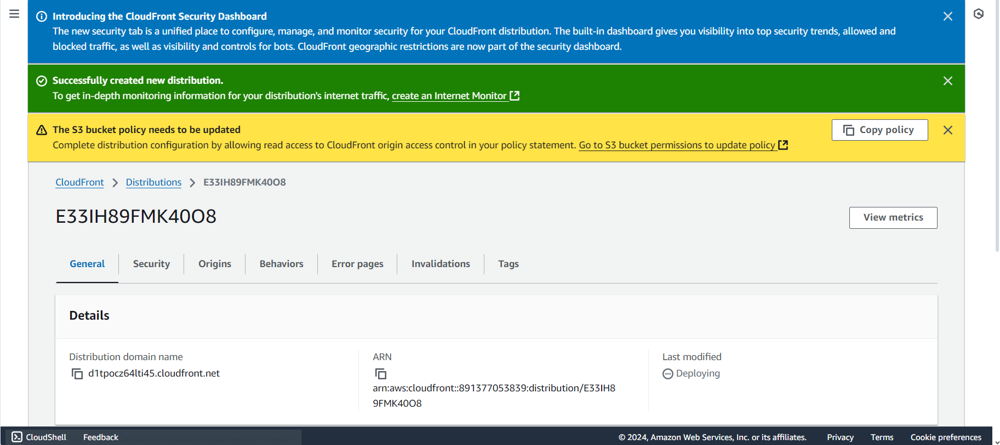
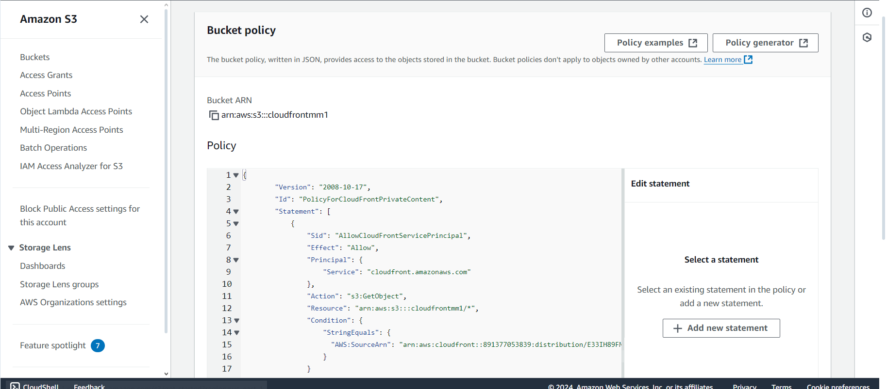
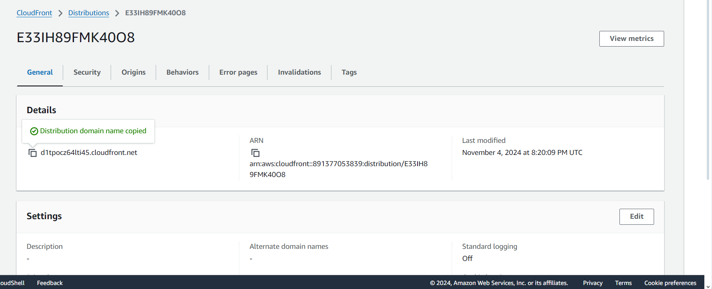

<h1>Securing-Content-Delivery-with-Amazon-CloudFront-and-Origin-Access-Control-OAC</h1>

<h2>Description</h2>
This project utilizes Amazon CloudFront, a content delivery network (CDN), integrated with Amazon S3 and secured through Origin Access Control (OAC). The goal is to deliver content to users with high performance and low latency while maintaining strict security controls to restrict direct access to the origin (S3 bucket). OAC ensures that only CloudFront can access the S3 bucket, adding a layer of protection against unauthorized access. This configuration helps websites, applications, or media streaming platforms deliver secure, scalable, and fast content globally.
<br />

<h2>Deliverables </h2>

- <b>A visual representation of the CloudFront-S3-OAC setup..</b> 
- <b>A live, functioning CloudFront distribution delivering secure content.
.</b>
- <b>A secure S3 bucket with appropriate bucket policies and OAC integration..</b>
- <b>Step-by-step setup guide, access policies, and caching strategies..</b>
- <b>A CloudFront URL demonstrating secure and fast content delivery..</b> 

<h2>Skills Demostrated:</h2>

- <b>Cloud Computing:
Configured Amazon CloudFront for global content delivery.
Secured Amazon S3 buckets using Origin Access Control (OAC).S.</b> 
- <b>Security and Access Management:
Applied IAM policies and bucket policies to restrict access.
Enforced HTTPS-only connections for secure data transmission..</b>
- <b>Performance Optimization:
Implemented caching strategies to reduce latency and enhance user experience.
Leveraged CloudFront edge locations for faster content delivery.</b>

<h2>Program walk-through:</h2>

<p align="center">
creat your s3 bucket: <br/>
 
<br />
 
<br />
Add object to your s3 bucket for Encryption:  <br/>

<br />

<br />
Navigate to cloudfront creat a cloudfront Distribution and select the s3bucket you created  <br/>

<br />

<br />
select OAC and creat a new OAC:  <br/>

<br />

Default root object "index.html":  <br/>

<br />

click creat:  <br/>

<br />

Navigate back to your s3 bucket policy and grant cloudfront access to s3 onject:  <br/>

<br />

copy the distribution domain name:  <br/>

<br />

Open a new tap on your browser and paste the Distribution:  <br/>

<br />
</p>

<!--
 ```diff
- text in red
+ text in green
! text in orange
# text in gray
@@ text in purple (and bold)@@
```
--!>
